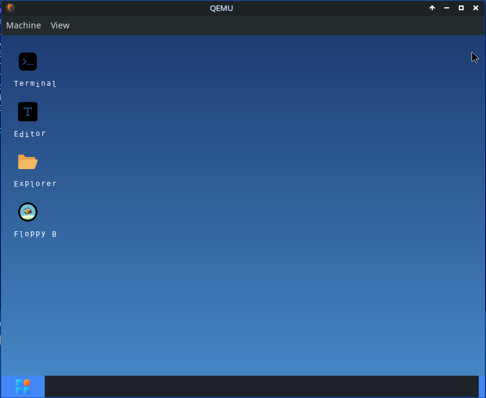

# NorthOS with GUI

NorthOS is a modified operating system based on the MIT xv6 (x86) kernel, extended with a custom graphical user interface and window manager.



## Overview

NorthOS transforms the traditional xv6 teaching operating system into a graphical environment while preserving the original xv6 kernel architecture. It uses a monolithic kernel derived from xv6 with multi-processor support, a VGA-based window manager, and a set of graphical user applications.

NorthOS is designed as an experimental and educational operating system project to explore kernel-level graphics, GUI systems, and userland applications built directly on top of the xv6 kernel.

Feel free to open an issue or submit a pull request to add new applications or improve the kernel logic.

## Core Features

* **xv6-based Monolithic Kernel**: Unix-inspired kernel design derived from MIT xv6 with preemptive multitasking.
* **GUI Subsystem**: Kernel-level window manager and low-level drawing primitives.
* **Mouse Support**: Integrated PS/2 mouse driver.
* **Userland Applications**: Terminal, File Explorer, Text Editor, and Games (Floppy Bird).
* **Icon System**: Automated conversion of PNG assets into C arrays for UI rendering.

## Toolchain & Requirements

The NorthOS build system is designed specifically for **Linux** environments (native Linux or WSL2).

### Required Packages (Linux)

* `gcc` with 32-bit support (`gcc-multilib`)
* `binutils` with i386 support
* `qemu-system-i386` for emulation
* `make` for build automation
* `golang` (version 1.20 or newer) for build utilities
* `python3` with `Pillow` for asset processing

### Installation (Debian/Ubuntu)

```bash
sudo apt update
sudo apt install build-essential qemu-system-x86 golang python3 python3-pip
pip3 install Pillow
```

## Build and Execution

The `Makefile` automates the full build pipeline for the NorthOS kernel, userland, and disk images.

### Compilation

Build the kernel, user programs, and filesystem images:

```bash
make -j$(nproc)
```

### Running in QEMU

Launch NorthOS using QEMU:

```bash
make run
```

## Asset Conversion Scripts

### convert.py

Converts window UI icons (such as close and minimize buttons) from PNG files into C arrays.

```bash
python3 convert.py
```

### font.py

Converts a TrueType font (`fonts/font.ttf`) into bitmap character arrays for text rendering.

```bash
python3 font.py
```

### convert_icons.py

Converts desktop application icons from PNG files into C arrays. Place 48x48 PNG icons inside the `app_icons/` directory.

```bash
python3 convert_icons.py
```

## Project Structure

* `kernel/`: xv6-based kernel source code (scheduler, memory management, filesystem, and GUI logic)
* `user/`: User-space applications and supporting libraries
* `include/`: Shared header files
* `icon/`: PNG assets for window UI elements
* `app_icons/`: PNG assets for desktop applications
* `fonts/`: TrueType fonts used for text rendering
* `scripts/`: Go and Python scripts used during the build process

## Build Process Analysis

1. `convert.py` scans `icon/*.png` and generates `icons_data.c`
2. `font.py` converts `fonts/font.ttf` into `character.c` and `character.h`
3. `convert_icons.py` scans `app_icons/*.png` and generates `app_icons_data.c` and `app_icons.h`
4. GCC compiles the NorthOS kernel and user programs using `-m32` for the i386 architecture
5. Linker scripts (`kernel.ld`) define the final kernel memory layout
6. The `mkfs` utility generates `fs.img` containing user-space programs
7. `dd` combines the bootloader and kernel into `NorthOS.img`

## License

MIT License.

NorthOS is derived from the **MIT xv6-public** source code and remains compatible with the original xv6 license.
